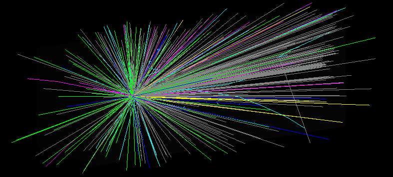

# Janus

### A personal exploration of a Geant4 target simulation handed to Xsuite for tracking.

Janus is the configuration and the file passed between a Geant4 target run and an Xsuite tracking run. Geant4 handles the interactions. Xsuite handles the tracking.

> **Status:** Not currently active. Janus grew out of an exploration of
> Geant4 particle production and Xsuite beam transport. I’m keeping the code
> and notes here in case I return to it.

## System



The case study considered 26 GeV proton bombardment of a high-Z target, with antiproton production as the primary observable.

```text
Geant4 (engines/geant4/, collision/)
        ↓
simulation.root (Seeds) + validation.root
        ↓
transport/config.json  →  Xsuite beamline
        ↓
particle tracking
        ↓
NPZ outputs / diagnostics  (data/transport/run_*/)
```

Geant4 supplies the interaction. ROOT `Seeds` carry that particle data into transport. Xsuite tracks the beam. The NPZ file and diagnostic plots are the output of that pass.

## Components

| Component                          | Purpose                                                                  |
| ---------------------------------- | ------------------------------------------------------------------------ |
|Geant4          | Target bombardment and particle production                          |
| ROOT                | Structured collision and particle data                                    |
| Xsuite        | Beam transport and tracking                            |
| Janus     | Configuration and the handoff between the two runs |

Run notes: [collision guide](docs/guides/collision_guide.md), [transport guide](docs/guides/transport_guide.md). [Architecture](docs/ARCHITECTURE.md), [Physics](docs/PHYSICS.md), and the [roadmap](docs/Janus_Architectural_Roadmap.md) describe a larger program than the code implements.

### Validation

Collision and transport are checked separately. Janus does not revalidate Geant4 hadronic models or Xsuite element physics.

`validate.py` checks charge, baryon number, and energy–momentum balance on `validation.root`. The Geant4 app adjusts the recorded residual nucleus so that balance holds before the script runs. `physical_validation.py` plots distributions from both ROOT files. These scripts need `awkward` and `particle`, which are not all in `requirements.txt`. [Collision validation](docs/validation/collision_validation.md).

```bash
python collision/validation/validate.py
python collision/validation/physical_validation.py
```

Transport tests cover topology → construct → inherit → track → write. They use synthetic arrays or a small `Seeds` tree and do not need Geant4. [Transport validation](docs/validation/transport_validation.md).

```bash
pytest tests/transport/
```

### Reproducing the Pipeline

Collision needs a built Janus Geant4 engine ([installation](docs/guides/geant4_installation.md)). Transport needs a `data/collision/*/simulation.root` from a collision run. Transport tests need only `pip install -r requirements.txt`.

```bash
pip install -r requirements.txt

python collision/run.py      # → data/collision/<run>/
python transport/run.py      # topology: transport/config.json
pytest tests/transport/
```

- Collision: [`collision/config.json`](collision/config.json) — [guide](docs/guides/collision_guide.md)
- Transport: [`transport/config.json`](transport/config.json) — [guide](docs/guides/transport_guide.md)

Transport writes `data/transport/run_<timestamp>/` (`transported_particles.npz`, `topology.json`, diagnostic PNGs).


## Acknowledgements

Collision uses [Geant4](https://geant4.web.cern.ch/).

>- [Recent Developments in Geant4](https://doi.org/10.1016/j.nima.2016.06.125), J. Allison et al., Nucl. Instrum. Meth. A 835 (2016) 186–225
>- [Geant4 Developments and Applications](https://doi.org/10.1109/TNS.2006.869826), J. Allison et al., IEEE Trans. Nucl. Sci. 53 (2006) 270–278
>- [Geant4 — A Simulation Toolkit](https://doi.org/10.1016/S0168-9002%2803%2901368-8), S. Agostinelli et al., Nucl. Instrum. Meth. A 506 (2003) 250–303

Transport uses [Xsuite](https://xsuite.readthedocs.io/):

> G. Iadarola, R. De Maria, S. Łopaciuk, A. Abramov, X. Buffat, D. Demetriadou, L. Deniau, P. Hermes, P. Kicsiny, P. Kruyt, A. Latina, L. Mether, K. Paraschou, G. Sterbini, F. F. Van Der Veken, P. Belanger, P. Niedermayer, D. Di Croce, T. Pieloni, L. Van Riesen-Haupt, M. Seidel. [“Xsuite: An Integrated Beam Physics Simulation Framework,”](https://inspirehep.net/literature/2705250) JACoW HB2023 (2024), TUA2I1.

## Notes

Janus connects Geant4 output to Xsuite transport. The transport path has tests, while collision
validation is covered by scripts rather than a pytest suite. Running the full
pipeline also requires a separate Geant4 setup.
