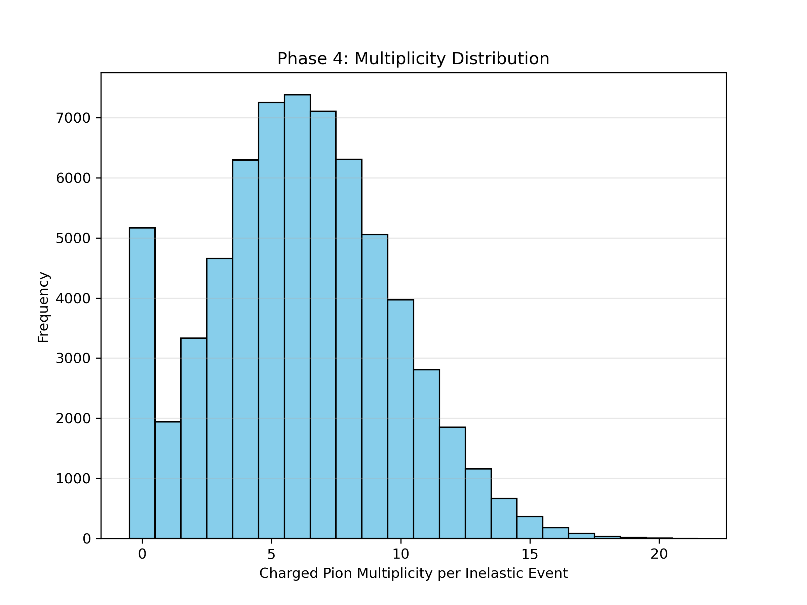
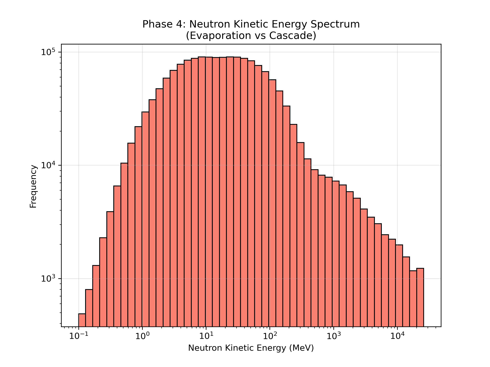

# Generalized Validation Framework for Monte Carlo Physics Engines

High-energy physics Monte Carlo transport engines such as Geant4 simulate complex stochastic interaction that are inherently difficult to benchmark. To ensure downstream data integrity, a simulation pipeline requires a strict, autonomous, and physically rigorous validation architecture.

This document outlines a generalized 4-phase validation framework designed to evaluate any physics engine. The framework systematically verifies fundamental mathematical invariants, discrete quantum bounds, macroscopic statistical limits, and realistic distributions before allowing data to proceed.

---

## The Generalized Extraction Architecture

To decouple validation logic from the inner workings of the transport engine, the architecture relies on an absolute separation of tracking points into two independent data streams:

1. **Terminal State Node (The "Validation" Node):**
   Captures the system exclusively at the terminal boundaries of an interaction (e.g., immediately post-collision). It records the absolute pre-collision initial state and the final fragmented asymptotic state. This node must be dynamically aware, capturing instantaneous properties like sampled isotope variations and specific beam parameters per event.
   
2. **Birth State Node (The "Seed" Node):**
   A global tracking hook that captures the fundamental birth parameters ($t=0$ position, momentum, energy, and PID) of every secondary particle generated anywhere in the target geometry, enabling spatial and kinematic distribution analyses.

---

## Phase 1: Kinematic Invariant Evaluator 

**Objective:** Verify the absolute conservation of relativistic 4-momentum ($\Delta E, \Delta \vec{p}$).

**Framework Logic:**
* **Energy Tracking:** A physics engine must conserve total energy. The pipeline performs a summation of the final state energies ($\sum E_{out}$) and momenta ($\sum \vec{p}_{out}$) for all terminal fragments and compares them against the initial state collision kinematics.
* **Implementation Standard:** If the invariant error exceeds a predefined microscopic tolerance ($\epsilon$), the pipeline must trigger a fatal exception. 

> **NOTE**: <br>
> Specifically for Janus, it was observed that heavy fragments of the target itself were contaminating the momentum conservation check. The fix was:<br>
> If the error is sub-threshold but non-zero, the framework mathematically absorbs the residual energy and momentum into the heaviest target fragment, maintaining exact 4-momentum preservation.

---

## Phase 2: Quantum Number Gatekeeper

**Objective:** Enforce the strict conservation of discrete quantum invariants, specifically total electrical Charge ($Q$) and Baryon Number ($B$).

**Framework Logic:**
* **Dynamic Parameter Deduction:** The framework deduces the exact target isotope dynamically. By evaluating the collective $Q$ and $B$ values of the outgoing fragments, it calculates the dynamic initial bounds ($Q_{initial} = Q_{target} + Q_{beam}$).
* **Implementation Standard:** The script iterates over the final state tensor, decodes particle IDs into their discrete quantum constituents, and verifies the sum exactly matches the dynamic initial bounds. Any discrete violation represents a catastrophic mathematical breakdown in the tracking engine.

---

## Phase 3: Statistical Benchmark

**Objective:** Validate the statistical and macroscopic likelihood of the generated event batch, preventing mathematically conserved but physically impossible scenarios (e.g., unphysical explosions of matter).

**Framework Logic:**
* **Yield Caps:** The pipeline evaluates the macroscopic ratios of rare particles. The framework compares rare-particle yields against expected theoretical or experimental values and flags significant deviations.
* **Multiplicity Bounds:** Computes the mean fractional generation of standard cascade particles (such as charged pions in hadronic showers). 
* **Implementation Standard:** By establishing predefined boundaries for mean particle generation per inelastic event, the pipeline autonomously catches severe algorithmic regressions in the underlying physics models.

---

## Output for phases 1-3:

The physics engine was validated using 100,000 events, and the following output was generated in the terminal:

```
========== JANUS VALIDATION REPORT ==========
Events Validated: 100000
Phase 1 Passed: Kinematic Conservation Verified.
  -> Maximum ΔE Error: 3.2014213502407074e-10 MeV
  -> Maximum ΔP Error: 2.1845111499714025e-11 MeV/c
Phase 2 Passed: Quantum Number Conservation Verified.
  -> Mean Event Charge (Q): 75.0 (Mean Expected: 75.0)
  -> Mean Event Baryon (B): 184.9 (Mean Expected: 184.9)
Phase 3 Sanity Checks Passed:
  -> Total Antinucleons Generated: 430
  -> Global Baryon Conservation Verified.   
  -> Mean Charged Pions per Inelastic Event: 4.0194

[+] Validation Suite Passed Successfully. Transport simulation may proceed.
```

---

## Phase 4: Emergent Behaviour Validation

**Objective:** Verifies that the generated particle fields mimic realistic high-energy interactions by plotting and analyzing their macroscopic shapes.

**Framework Logic:**
While Phases 1-3 assess the mathematical validity of the engine, Phase 4 provides phenomenological validation. A generalized framework achieves this through targeted observable plotting:
1. **Kinematic Jetting ($p_T$ vs $p_L$):** Plots the 2D density distribution of transverse vs. longitudinal momentum. It ensures that high-energy collisions correctly produce forward-peaked momentum jets ($p_L \gg p_T$) characteristic of relativistic beam dynamics.
2. **Particle Multiplicity:** Verifies that the histogram of generated fragments per event shapes into a physical Poisson or Negative Binomial Distribution (NBD), rather than a uniform or anomalous spread.
3. **Spectroscopic Evaporation:** Evaluates scalar kinetic energy spectra (e.g., neutron distributions). It confirms the presence of dual-physical phenomena: the low-energy isotropic evaporation spike and the high-energy forward cascade tail.
4. **Spatial Decay Profiles:** Extracts spatial interaction vertices ($\vec{x}, \vec{y}, \vec{z}$) and demonstrates the interactions follow an exponential decay curve $\exp(-x/\lambda)$ through the target volume, conforming to the theoretical mean-free-path of the material.

---

## Plots generated for 100,000 particles using phase 4:



 


---

#### By using this framework to validate the high-energy physics engine of Janus, we can establish confidence that it is physically valid, reliable, and is ready for further use in downstream applications - the transport pipeline and optimization studies.

---
