# Transport Validation

This chapter documents the scientific validation of the Janus particle transport engine. Transport integrates the relativistic Lorentz equation for charged particles in user-defined electromagnetic lattices. Before the engine is used in beam optics or optimization studies, its numerical behaviour must be verified at multiple levels of complexity.

Validation is **hierarchical**. Where closed-form or paraxial analytical solutions exist, individual lattice elements are checked against them at the single-particle level. Composite beamlines generally do not admit simple trajectory references; validation therefore transitions to **beam-level diagnostics** that probe collective transport quality. Optimization studies are only meaningful once both levels have been independently validated.

Particles are advanced with the Boris algorithm:

$$
\frac{d\mathbf{p}}{dt}
=
q\left(\mathbf{E}+\mathbf{v}\times\mathbf{B}\right),
\qquad
\mathbf{p}=\gamma m\mathbf{v}.
$$

Initial conditions for single-element studies are drawn from validated collision outputs (Geant4) or deterministic mock sources. Composite studies use 50-particle Gaussian beams with finite transverse extent and momentum spread. A case **passes** when all required metrics lie within declared tolerances; conservation metrics must remain below $10^{-6}$ relative drift, trajectory errors below element-specific bounds, and transverse RMS emittance drift below 5% in planes where dispersion is not expected.

---

# Part I — Single-Element Validation

Each isolated element is transported with a single reference particle. The numerical trajectory is compared against an analytical or paraxial reference while relativistic momentum and energy conservation are monitored. Timestep refinement confirms that discretization error decreases systematically as $\Delta t$ is reduced.

---

## Drift

### Physical model

A drift region has $\mathbf{B}=\mathbf{0}$ and $\mathbf{E}=\mathbf{0}$. The particle moves in a straight line at constant velocity:

$$
\mathbf{r}(t)=\mathbf{r}_0+\mathbf{v}_0 t.
$$

### Analytical reference

The reference solution is the exact kinematic trajectory above, evaluated at every recorded timestep using the particle's initial position and velocity.

### Validation methodology

A single proton from Geant4 is transported through a 100 m drift. Coordinate errors $|x-x_\mathrm{ref}|$, $|y-y_\mathrm{ref}|$, and $|z-z_\mathrm{ref}|$ are computed at each step. Momentum and energy conservation are reported as the maximum relative deviation from initial values over the trajectory. Timestep convergence uses analytical-reference refinement: the exit-state error is evaluated at eight successively halved timesteps and must decrease monotonically on a log–log plot (second-order behaviour expected for the Boris integrator).

### Results

| Quantity | Result | Criterion |
|----------|--------|-----------|
| $x$ error | $4.0\times10^{-15}\,\mathrm{m}$ | $\le 10^{-6}\,\mathrm{m}$ |
| $y$ error | $6.7\times10^{-15}\,\mathrm{m}$ | $\le 10^{-6}\,\mathrm{m}$ |
| $z$ error | $1.4\times10^{-13}\,\mathrm{m}$ | $\le 10^{-6}\,\mathrm{m}$ |
| Momentum conservation | $0$ | $\le 10^{-6}$ |
| Energy conservation | $0$ | $\le 10^{-6}$ |
| Timestep refinement | PASS | monotonic decrease |

The coordinate error plot demonstrates **trajectory agreement**: numerical and analytical positions are indistinguishable at machine precision. The conservation plot confirms that the field-free integrator introduces no spurious momentum or energy exchange. Timestep convergence verifies second-order accuracy of the Boris scheme in the absence of field interpolation.

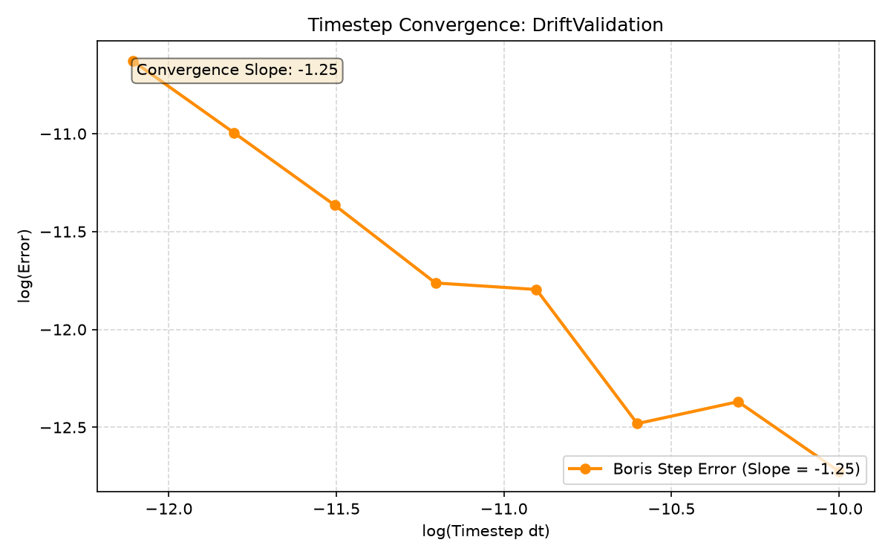

---

## Dipole

### Physical model

A uniform dipole with vertical field $\mathbf{B}=(0,B_y,0)$ bends the particle in the horizontal ($x$–$z$) plane. For momentum rigidity $B\rho$ and bend angle $\theta$:

$$
R = \frac{p_\perp}{qB_y}, \qquad \theta = \frac{q B_y L}{p}.
$$

The analytical reference follows circular arc motion with radius $R$ and entry angle $\theta_\mathrm{entry}$.

### Analytical reference

The reference computes the expected cyclotron radius and bend angle from the particle's rigidity and the dipole field. Pointwise trajectory data are used to assess radial deviation from the fitted circular orbit inside the magnet.

### Validation methodology

A single antiproton from Geant4 is transported through a 1000 m dipole with $B_y=0.5\,\mathrm{T}$. Metrics include relative cyclotron-radius error, relative bend-angle error, momentum and energy conservation, and analytical timestep convergence. The error plot reports radial deviation from a least-squares circle fit to the in-magnet trajectory.

### Results

| Quantity | Result | Criterion |
|----------|--------|-----------|
| Cyclotron radius error | $1.9\times10^{-7}$ | $\le 10^{-4}$ |
| Momentum conservation | $1.9\times10^{-7}$ | $\le 10^{-6}$ |
| Energy conservation | $1.2\times10^{-14}$ | $\le 10^{-6}$ |
| Bend angle error | — | $\le 10^{-2}$ |
| Timestep refinement | PASS | monotonic decrease |

The cyclotron-radius error and conservation metrics confirm that the numerical orbit curvature matches the analytical prediction and that the bending field does not introduce non-physical energy exchange. Timestep refinement passes with errors decreasing from $\sim6\times10^{-7}$ at $\Delta t=10^{-10}\,\mathrm{s}$ to $\sim4\times10^{-11}$ at $\Delta t=7.8\times10^{-13}\,\mathrm{s}$. The bend-angle summary metric is not yet robust for Geant4-sourced entry conditions (the reported value is undefined for the current test particle); orbit-radius agreement and conservation provide the primary validation of bending physics.

The error plot shows **radial deviation from the fitted circular orbit** — a direct test of curved-trajectory fidelity. The conservation plot verifies that bending is handled without spurious heating.

---

## Quadrupole

### Physical model

A linear quadrupole produces transverse focusing or defocusing with field components $B_x=Gy$ and $B_y=Gx$. The focusing strength is $k=qG/p_z$. Unlike transfer-matrix treatments, the full three-dimensional Boris integration does not assume the paraxial approximation.

### Analytical reference

A paraxial analytical reference under constant $p_z$ provides expected transverse coordinates as a function of time. This is an approximate reference: finite transverse velocity and field-entry effects mean exact agreement is not expected, but errors should remain small and bounded.

### Validation methodology

A single antiproton (mock source) is transported through a 1 m quadrupole with $k=0.5\,\mathrm{m}^{-2}$. Coordinate errors in $x$, $y$, and $z$ are compared against the paraxial reference. Conservation and self-convergence timestep refinement (eight refinement steps) complete the validation. Quadrupoles are validated individually before being placed inside composite lattices.

### Results

| Quantity | Result | Criterion |
|----------|--------|-----------|
| $x$ error | $8.1\times10^{-5}\,\mathrm{m}$ | $\le 10^{-4}\,\mathrm{m}$ |
| $y$ error | $7.9\times10^{-5}\,\mathrm{m}$ | $\le 10^{-4}\,\mathrm{m}$ |
| $z$ error | $5.2\times10^{-7}\,\mathrm{m}$ | $\le 10^{-6}\,\mathrm{m}$ |
| Momentum conservation | $2.8\times10^{-13}$ | $\le 10^{-6}$ |
| Energy conservation | $2.8\times10^{-13}$ | $\le 10^{-6}$ |
| Timestep refinement | PASS | monotonic decrease |

The coordinate error plot quantifies deviation from the paraxial reference across the magnet length. Errors at the $10^{-5}\,\mathrm{m}$ level are consistent with the non-paraxial nature of the full integration. Conservation at $10^{-13}$ relative drift confirms that the quadrupole field is applied without numerical heating. Timestep refinement demonstrates stable convergence under halved timesteps.

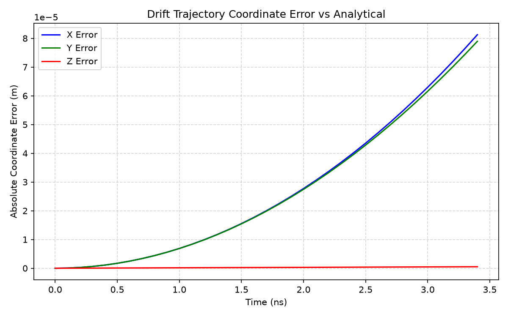
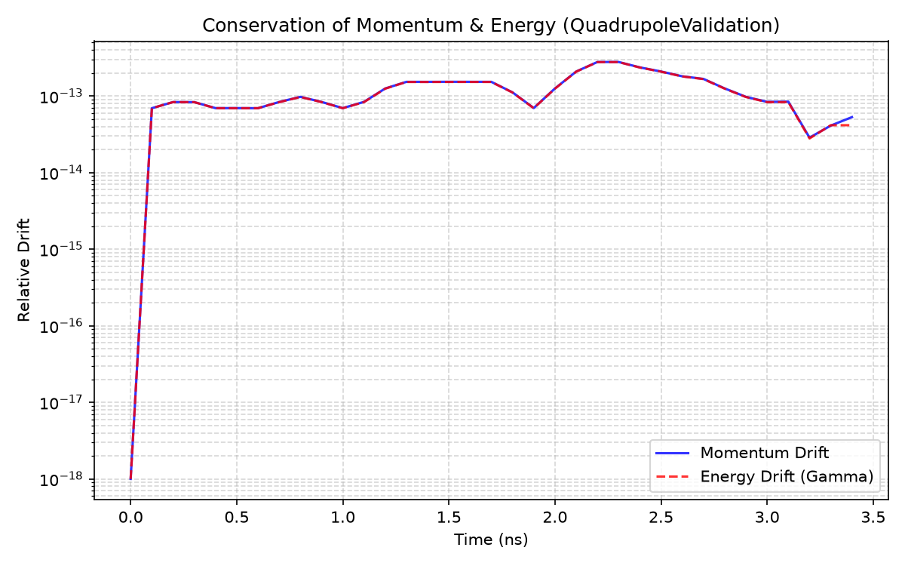
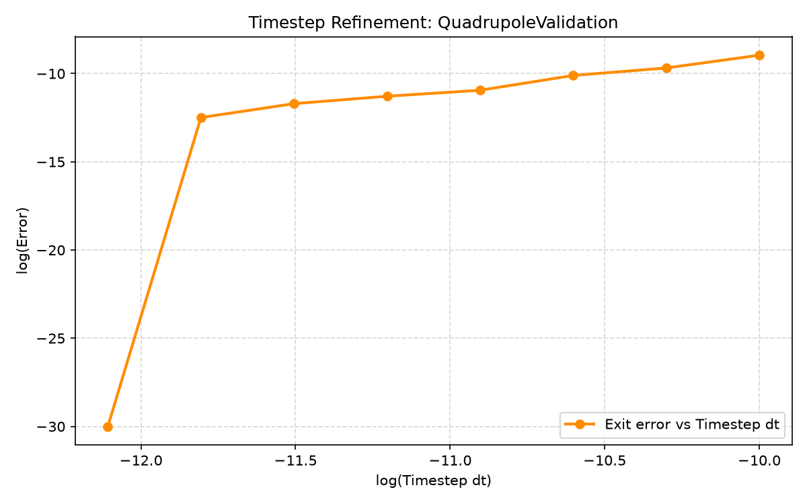

---

# Part II — Composite Beamline Validation

Composite lattices combine multiple elements in sequence. Even when each element is individually correct, **trajectory-level validation is no longer appropriate** for the assembly:

- Alternating-gradient systems amplify small phase differences between particles.
- Paraxial analytical references cannot represent the full coupled dynamics of multi-element transport.
- The physically meaningful question is whether the **beam** — not a single reference orbit — is transported stably.

Composite lattices are therefore validated through **beam-quality metrics**: conservation of relativistic invariants, evolution of the RMS beam envelope, and preservation of transverse RMS emittance. Vertical dashed lines on longitudinal plots mark element boundaries (Drift, QF, QD, Dipole).

Composite studies use 50-particle Gaussian beams. Timestep refinement for composite cases compares exit-state error at successively halved timesteps on a **linear** error-versus-$\Delta t$ plot.

---

## Drift → Dipole

### Lattice description

A 5 m drift section followed by a 10 m dipole with $B_y=0.5\,\mathrm{T}$ and 10 m aperture. The beam enters the dipole with finite transverse extent and momentum spread.

### Validation methodology

Momentum and energy conservation verify integrator fidelity through the element handoff. The RMS beam envelope $\sigma_x(z)$ and $\sigma_y(z)$ tracks collective beam size. Relative emittance drift $(\varepsilon-\varepsilon_0)/\varepsilon_0$ is evaluated in each transverse plane, where $\varepsilon_0$ is the initial RMS emittance. In dipole-containing lattices, horizontal emittance is **informational only** because dispersion naturally couples longitudinal and horizontal phase space; vertical emittance must remain bounded.

### Results

| Quantity | Result | Criterion |
|----------|--------|-----------|
| Momentum conservation | $5.7\times10^{-9}$ | $\le 10^{-6}$ |
| Energy conservation | $1.8\times10^{-12}$ | $\le 10^{-6}$ |
| Vertical $\varepsilon$ drift | $2.6\times10^{-3}$ | $\le 0.05$ |
| Transmission | 100% | $\ge 95\%$ |

Successful transport is indicated by flat conservation traces, smooth envelope evolution through the drift and bend, and bounded vertical emittance. The envelope plot shows the beam size responding to the drift–bend sequence; emittance plots confirm that vertical phase-space area is preserved to within the tolerance.

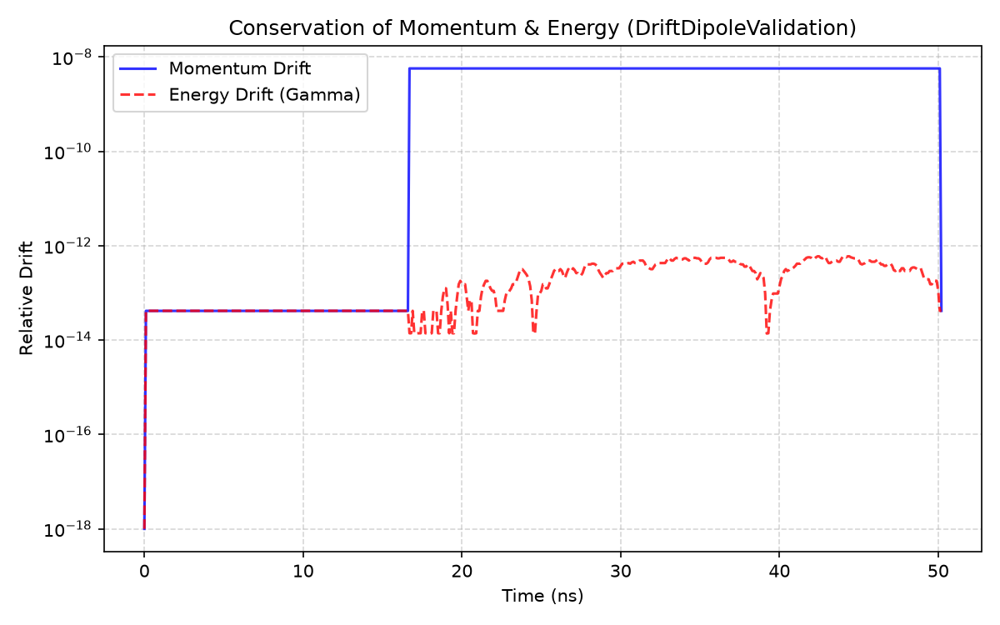
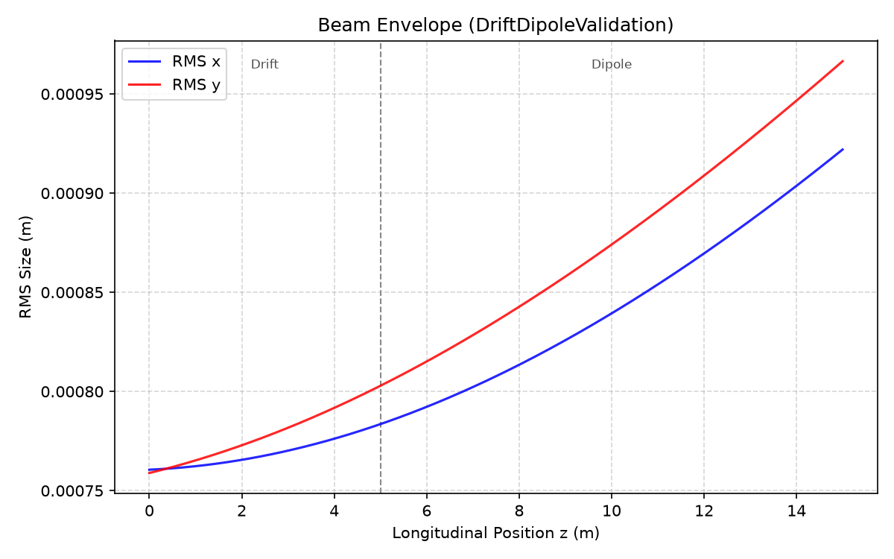
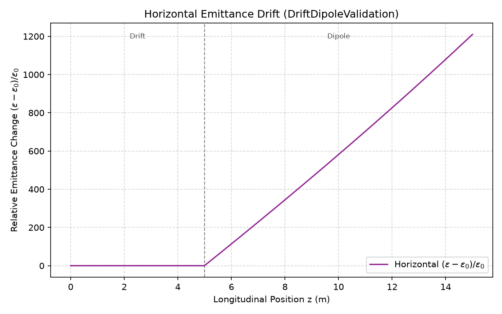
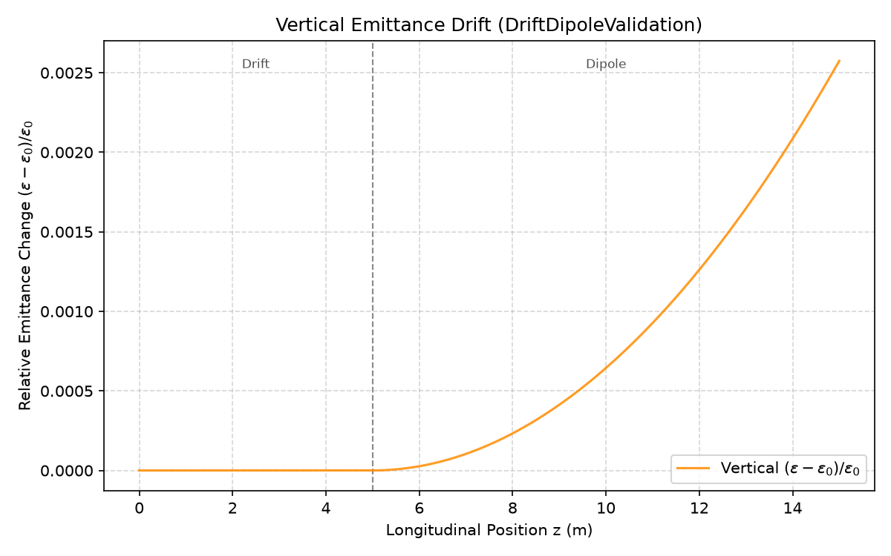

---

## Drift → Quadrupole

### Lattice description

A 2 m drift followed by a 1 m focusing quadrupole ($k=0.5\,\mathrm{m}^{-2}$). This is the minimal test of element composition before building alternating-gradient cells.

### Validation methodology

The same beam-quality metrics as above apply. Both transverse emittance planes are subject to the 5% drift tolerance because no dipole-induced dispersion is present.

### Results

| Quantity | Result | Criterion |
|----------|--------|-----------|
| Momentum conservation | $8.1\times10^{-13}$ | $\le 10^{-6}$ |
| Energy conservation | $8.1\times10^{-13}$ | $\le 10^{-6}$ |
| Horizontal $\varepsilon$ drift | $4.5\times10^{-7}$ | $\le 0.05$ |
| Vertical $\varepsilon$ drift | $4.5\times10^{-7}$ | $\le 0.05$ |
| Transmission | 100% | $\ge 95\%$ |

Conservation at machine precision, envelope growth consistent with focusing in the quadrupole, and negligible emittance drift in both planes confirm stable composition of drift and quadrupole elements.

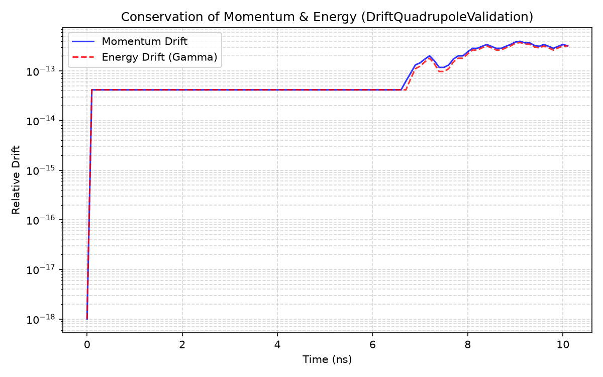
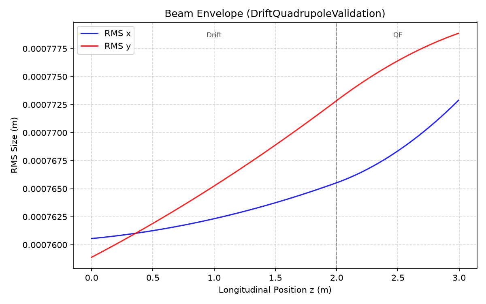
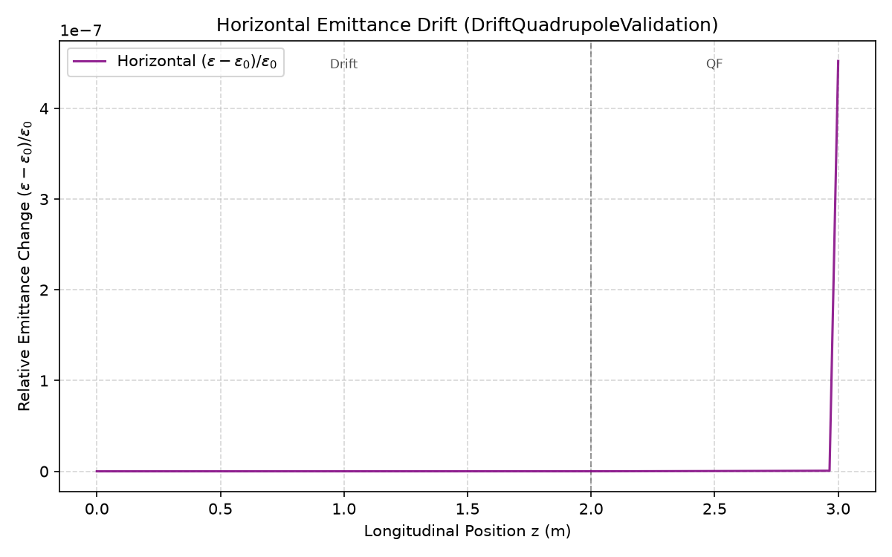
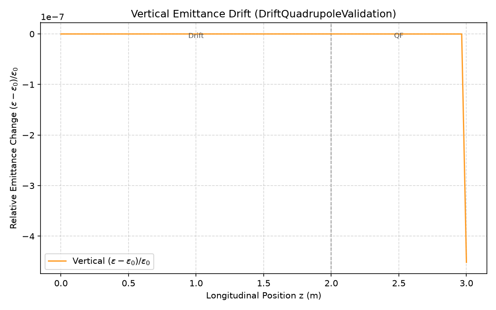

---

## FODO Cell

### Lattice description

A FODO (Focusing–Defocusing) cell alternates focusing (QF, $k>0$) and defocusing (QD, $k<0$) quadrupoles separated by drift spaces. The validated lattice repeats the cell

$$
\text{QF}(1\,\mathrm{m}) \;\|\; \text{Drift}(2\,\mathrm{m}) \;\|\; \text{QD}(1\,\mathrm{m}) \;\|\; \text{Drift}(2\,\mathrm{m})
$$

until a total length of 50 m is reached (1 m aperture).

### Validation methodology

Conservation, RMS envelope evolution, and relative emittance drift in both planes. Transmission and particle loss confirm that no beam is lost to aperture limits.

### Results

| Quantity | Result | Criterion |
|----------|--------|-----------|
| Momentum conservation | $3.4\times10^{-12}$ | $\le 10^{-6}$ |
| Energy conservation | $3.3\times10^{-12}$ | $\le 10^{-6}$ |
| Horizontal $\varepsilon$ drift | $2.5\times10^{-10}$ | $\le 0.05$ |
| Vertical $\varepsilon$ drift | $1.0\times10^{-10}$ | $\le 0.05$ |
| Transmission | 100% | $\ge 95\%$ |
| Particle loss | 0% | $\le 5\%$ |

The envelope plot shows **oscillatory beam-size evolution** characteristic of alternating-gradient transport: focusing quadrupoles compress one plane while defocusing quadrupoles expand it, and the pattern alternates along $z$. Emittance plots show bounded oscillations with negligible secular drift — the signature of stable beam transport through a periodic lattice. Element-boundary annotations mark each QF, QD, and drift section.

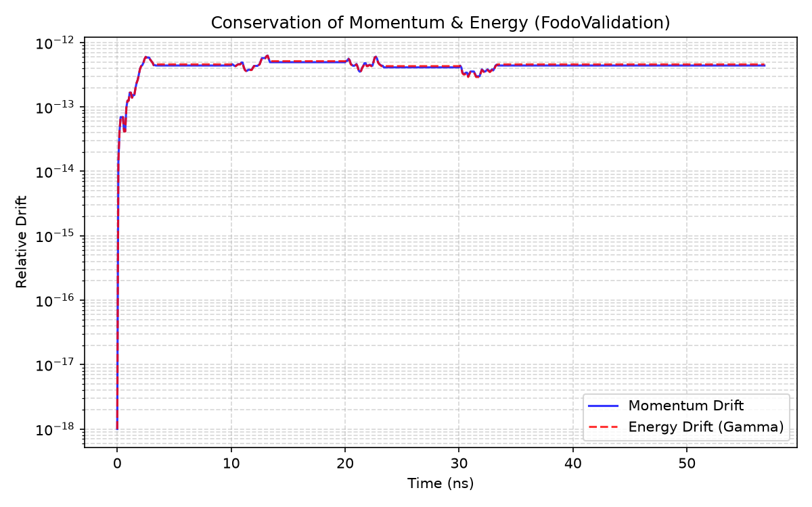
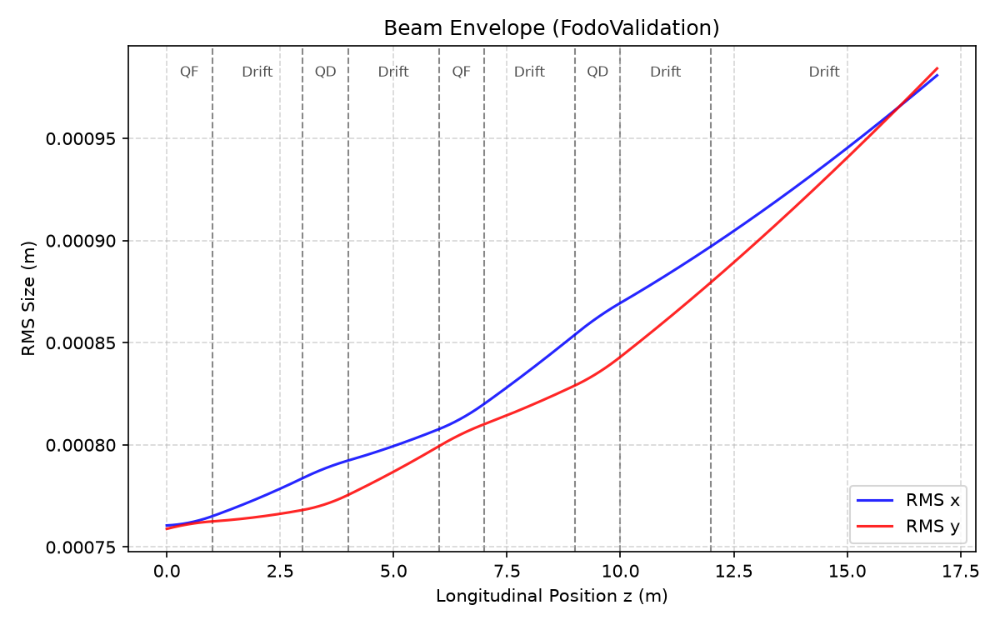
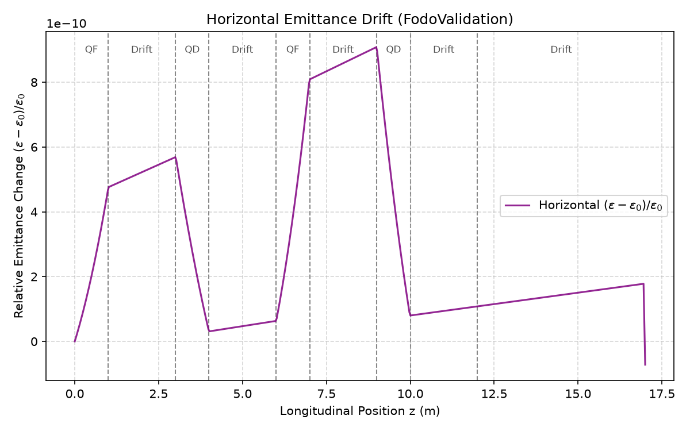
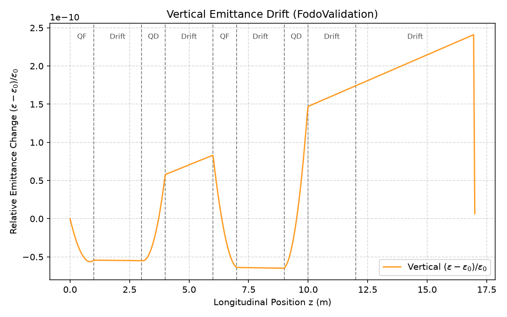

---

## Minimal ACOL Beamline

### Lattice description

This case validates a simplified beamline inspired by the ACOL antiproton collector: a 5 m injection drift followed by two complete FODO cells (four quadrupoles), for a total length of 17 m. It represents the first validation of a multi-cell transport pipeline approaching realistic lattice complexity.

### Validation methodology

Full beam diagnostics as for the FODO case: conservation, envelope, emittance drift, transmission, and particle loss.

### Results

| Quantity | Result | Criterion |
|----------|--------|-----------|
| Momentum conservation | $1.3\times10^{-12}$ | $\le 10^{-6}$ |
| Energy conservation | $1.3\times10^{-12}$ | $\le 10^{-6}$ |
| Horizontal $\varepsilon$ drift | $7.5\times10^{-11}$ | $\le 0.05$ |
| Vertical $\varepsilon$ drift | $2.9\times10^{-13}$ | $\le 0.05$ |
| Transmission | 100% | $\ge 95\%$ |
| Particle loss | 0% | $\le 5\%$ |

The injection drift allows the beam to evolve freely before entering the first FODO cell. Envelope and emittance behaviour remain stable across the full 17 m, demonstrating that the transport engine handles prefix drifts and repeated cell structure correctly.

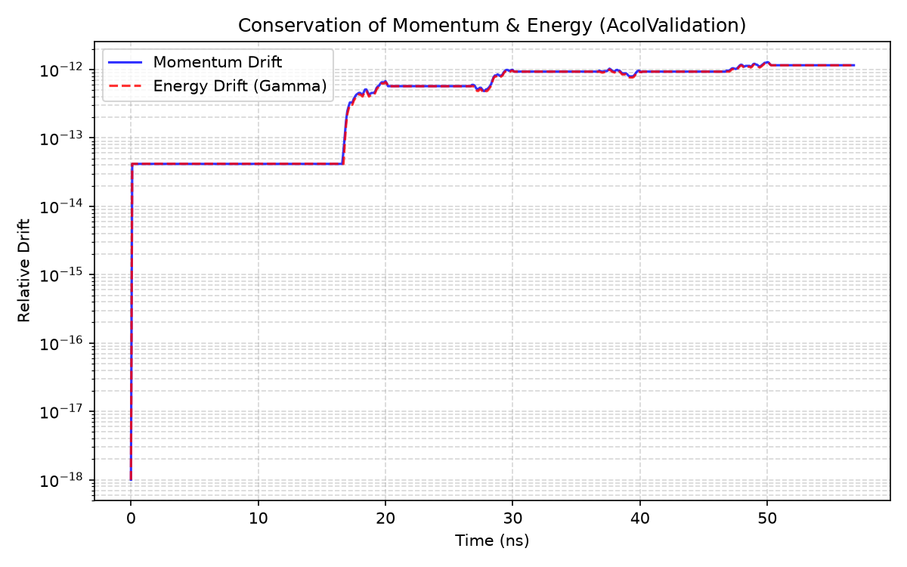
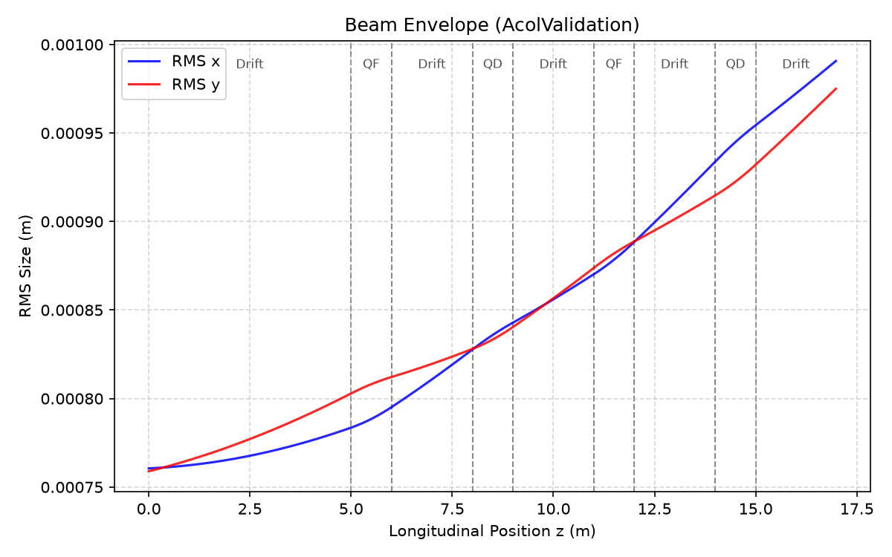
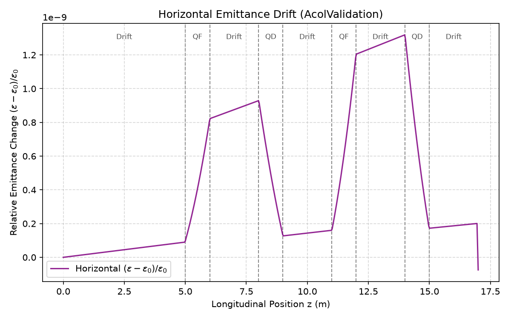
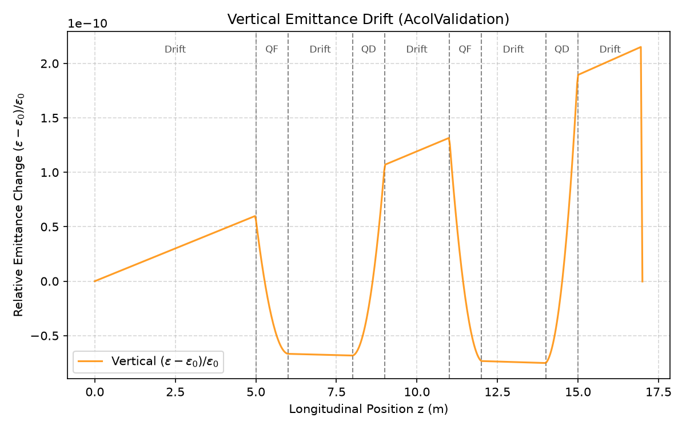

---

# Summary

| Validation         | Status | Method                |
| ------------------ | ------ | --------------------- |
| Drift              | ✅      | Analytical comparison |
| Dipole             | ✅      | Analytical comparison |
| Quadrupole         | ✅      | Analytical comparison |
| Drift → Dipole     | ✅      | Beam diagnostics      |
| Drift → Quadrupole | ✅      | Beam diagnostics      |
| FODO               | ✅      | Beam diagnostics      |
| Minimal ACOL       | ✅      | Beam diagnostics      |

---

# Conclusion

The Janus transport engine has been validated at three levels:

| Level | Cases | Outcome |
|-------|-------|---------|
| Single element | Drift, dipole, quadrupole | Analytical or paraxial trajectory agreement; machine-precision conservation |
| Simple composite | Drift → Dipole, Drift → Quadrupole | Stable beam envelope and emittance through element handoffs |
| Beam optics | FODO, minimal ACOL | Bounded envelope oscillations; emittance preserved over multi-cell lattices |

Across all studies the framework has demonstrated:

- **Analytical agreement** for implemented individual lattice elements (drift at machine precision; quadrupole within paraxial tolerance; dipole orbit radius to $\sim10^{-7}$ relative error).
- **Machine-precision conservation** of relativistic momentum and energy in field-free and magnetized regions.
- **Stable beam envelope evolution** through composite and alternating-gradient lattices.
- **Preservation of transverse RMS emittance** across composite beamlines, with horizontal emittance treated as informational in dipole-containing assemblies where dispersion is expected.
- **Consistent timestep refinement behaviour**, confirming that numerical error decreases under reduced $\Delta t$.

These validation studies provide confidence that the numerical transport framework is suitable for subsequent beam optics and optimization studies.
