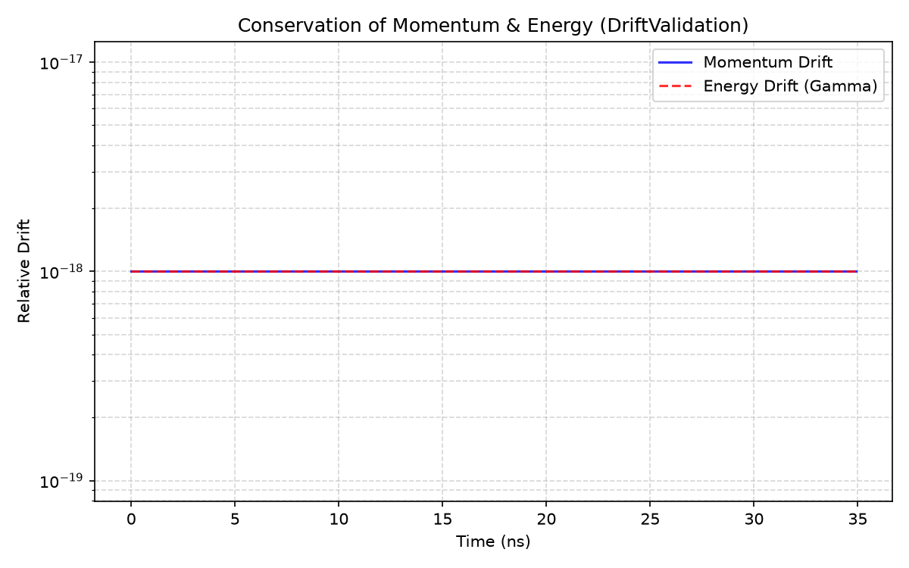
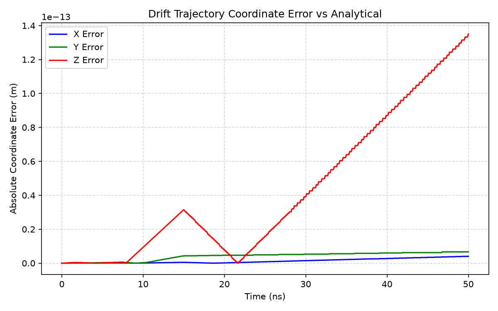
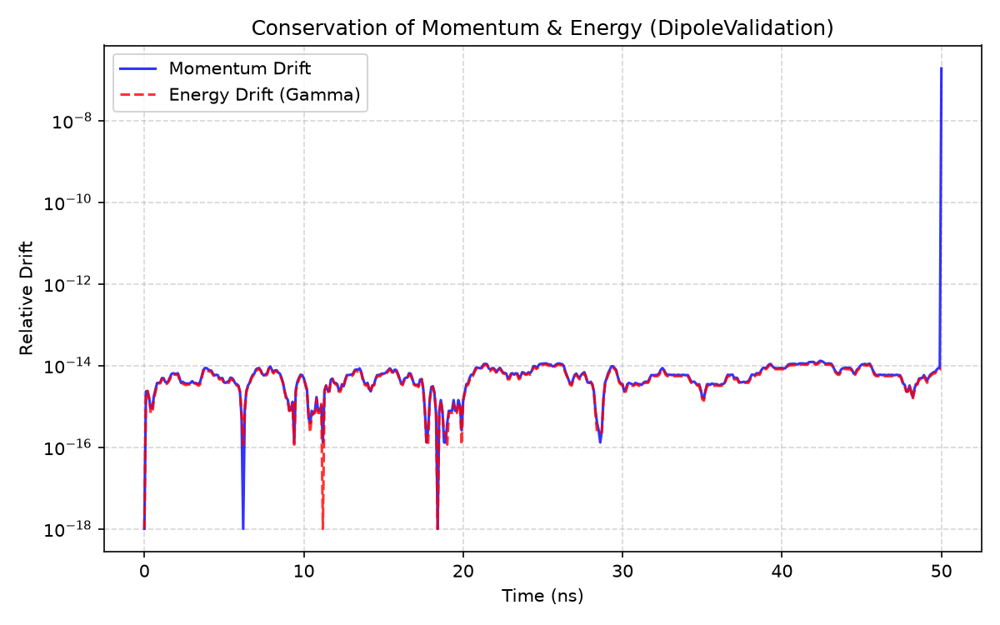
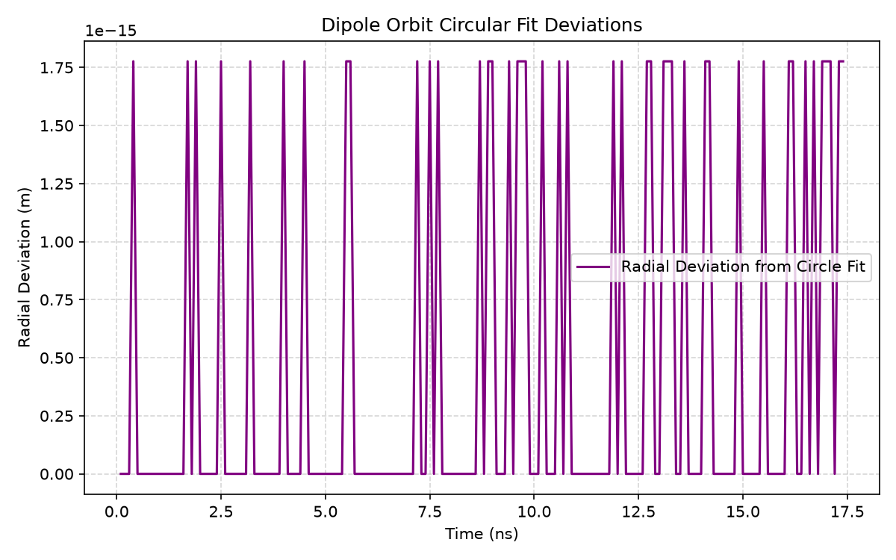
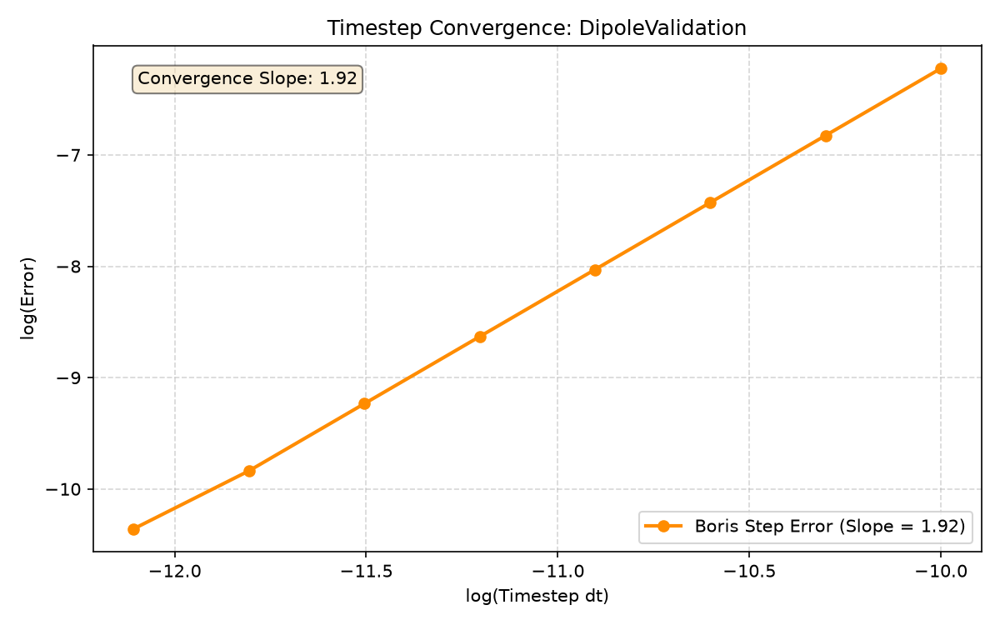

# Validation Framework for High-Energy Particle Transport

The transport engine is validated hierarchically by comparing numerical solutions of the relativistic Lorentz equation against analytical solutions for individual lattice elements. Each element is independently verified before being incorporated into larger beamline assemblies.

The governing equation is

$$
\frac{d\mathbf{p}}{dt}
=
q\left(\mathbf{E}+\mathbf{v}\times\mathbf{B}\right),
\qquad
\mathbf{p}=\gamma m\mathbf{v}.
$$

The relativistic Boris algorithm is used for time integration and is validated through conservation tests and timestep refinement studies. The numerical convergence order is estimated from the asymptotic slope of a log-log timestep refinement study comparing numerical trajectories against analytical solutions.

Validation is performed using particles generated by the independently validated Geant4 collision stage. Consequently, all transport studies are carried out using physically realistic particle species, energies, and initial phase-space coordinates rather than synthetic initial conditions. Details of the collision-stage validation are available in [docs/collision_validation.md](docs/collision_validation.md).

---

# Drift

For

$
\mathbf{B}=0,
$

the analytical solution is

$
\mathbf{r}(t)=\mathbf{r}_0+\mathbf{v}_0t.
$

The numerical solution is compared against the analytical trajectory while verifying:

- Position error
- Momentum conservation
- Energy conservation
- Timestep convergence




---

# Uniform Dipole

For a uniform magnetic field,

$
\mathbf{B}=(0,B_y,0),
$

the analytical solution is uniform circular motion with

$
R=\frac{p}{qB},
$

and

$
\theta=\frac{qBL}{p}.
$

The numerical trajectory is compared against the analytical solution while verifying:

- Cyclotron radius
- Bend angle
- Momentum conservation
- Energy conservation
- Second-order convergence




### The calculated slope is `1.96`, which approaches the theoretical estimation of `2`.



---

# Validation Summary

| Component | Status |
|-----------|:------:|
| Boris Integrator | ✅ |
| Drift | ✅ |
| Uniform Dipole | ✅ |

The transport framework reproduces the analytical solutions for the validated lattice elements while preserving the physical invariants of relativistic charged-particle motion. Timestep refinement demonstrates asymptotic second-order convergence, consistent with the theoretical accuracy of the relativistic Boris integrator. These validated components provide the foundation for subsequent composite lattice, beam transport, and optimization studies.

---

# Experiment Configuration

Validation studies are defined by YAML experiment files under `transport/experiment/examples/`. Run a study with:

```bash
python -m transport.main --experiment transport/experiment/examples/dipole.yaml
```

With no arguments, `main.py` runs the default dipole example.

Schema (authoritative fields):

```yaml
experiment:
  name: dipole_level1
  level: 1
  case: dipole
  output_dir: transport/validation/outputs

particle_source:
  type: geant4            # single | mock | gaussian_beam | geant4 | file
  species: antiproton
  charge_filter: antiproton
  n_particles: 1
  momentum_slice: [3480, 3680]   # MeV/c, geant4 only

lattice:
  z_start: 0.0
  elements:
    - {type: drift,  length: 5.0,  aperture: 0.1}
    - {type: dipole, length: 5.0,  by: 1.0, aperture: 0.1}

numerical:
  dt: 1.0e-10
  max_steps: 500
  max_steps_conv: 150
  convergence: {enabled: true, mode: analytical, num_points: 8, refinement_ratio: 2.0}
  solver: boris

validation:
  metrics:
    - {name: momentum_conservation, tolerance: 1.0e-6, direction: le}
  pass_criteria: all_must_pass

outputs: {report: true, json: true, csv: true, manifest: true, plots: true}
```

Example files: `drift.yaml`, `dipole.yaml`, `drift_dipole.yaml`.

**Adding a lattice element:** implement an `Element` subclass and register a factory in `transport/lattice/registry.py`.

**Adding a convergence strategy:** implement `ConvergenceStrategy` and register in `transport/validation/registry.py` via `convergence_registry`.

---

# Multi-Species

Species are declared in `particle_source.species`. Mass and charge are resolved from `transport/physics/particle_data.py` and carried on `ParticleBatch` and `ValidationContext` through the solver, references, and metrics. The run manifest records species and resolved mass for provenance.